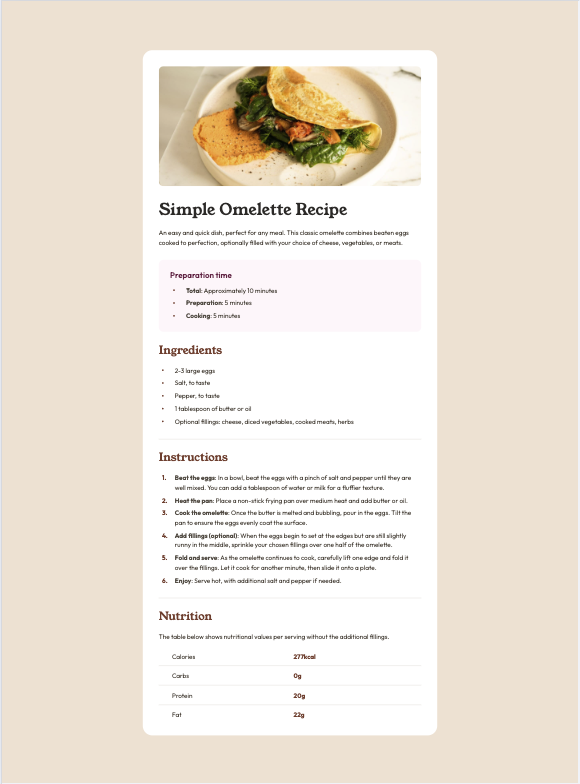
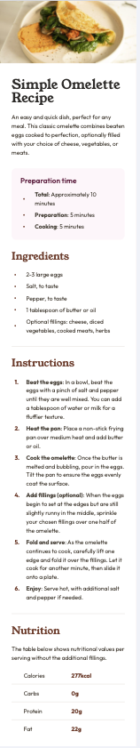

# Frontend Mentor - Recipe page solution

This is a solution to the [Recipe page challenge on Frontend Mentor](https://www.frontendmentor.io/challenges/recipe-page-KiTsR8QQKm). Frontend Mentor challenges help you improve your coding skills by building realistic projects.

## Table of contents

- [Frontend Mentor - Recipe page solution](#frontend-mentor---recipe-page-solution)
  - [Table of contents](#table-of-contents)
  - [Overview](#overview)
    - [Screenshot](#screenshot)
      - [Desktop](#desktop)
      - [Mobile](#mobile)
    - [Links](#links)
  - [My process](#my-process)
    - [Built with](#built-with)
    - [What I learned](#what-i-learned)
      - [List customization](#list-customization)
      - [Schema for SEO](#schema-for-seo)
    - [Continued development](#continued-development)
    - [Useful resources](#useful-resources)
  - [Author](#author)

## Overview

### Screenshot

#### Desktop



#### Mobile



### Links

- Solution URL: [Github](https://github.com/iddahadev/frontend-mentor-recipe-page)
- Live Site URL: [Website](https://iddahadev.github.io/frontend-mentor-recipe-page/)

## My process

### Built with

- Semantic HTML5 markup
- CSS custom properties
- Flexbox
- Mobile-first workflow
- Schema in JSON LD format

### What I learned

#### List customization

I discovered how to customize lists with css to get as close as possible to the design. But I think that it was not the appropriate approach for this challenge, I linked two resources in a section below that feel more appropriate.

```css
/* Reset lists style */
ol,
ul {
  list-style: none;
}

/* For unordered lists */
ul > li {
  /* Custom style */
}

ul > li::before {
  /* Custom style */
}

/* For ordered lists */
ol > li {
  counter-increment: count 1;
  /* Custom style */
}

ol > li::before {
  content: counter(count) ".";
  /* Custom style */
}
```

#### Schema for SEO

I added a [recipe schema](https://schema.org/Recipe) to this project. It was a good practice that I can't wait to implement in personal projects.

```json
{
  "@context": "https://schema.org",
  "@type": "Recipe",
  "author": {
    "@type": "Organization",
    "name": "Frontend Mentor"
  },
  "cookTime": "PT5M",
  "totalTime": "PT10M",
  "keywords": "vegetarian",
  "datePublished": "2024-07-09",
  "description": "An easy and quick dish, perfect for any meal. This classic omelette combines beaten eggs cooked to perfection, optionally filled with your choice of cheese, vegetables, or meats.",
  "image": "https://iddahadev.github.io/frontend-mentor-recipe-page/assets/images/image-omelette.jpeg",
  "recipeIngredient": [
    "2-3 large eggs",
    "Salt, to taste",
    "Pepper, to taste",
    "1 tablespoon of butter or oil",
    "Optional fillings: cheese, diced vegetables, cooked meats, herbs"
  ],
  "name": "Simple Omelette Recipe",
  "nutrition": {
    "@type": "NutritionInformation",
    "calories": "277 calories",
    "fatContent": "22 grams fat",
    "proteinContent": "20 grams protein",
    "carbohydrateContent": "0 grams carbs"
  },
  "prepTime": "PT5M",
  "recipeInstructions": [
    {
      "@type": "HowToStep",
      "name": "Beat the eggs",
      "text": "Beat the eggs with a pinch of salt and pepper until they are well mixed. You can add a tablespoon of water or milk for a fluffier texture."
    },
    {
      "@type": "HowToStep",
      "name": "Heat the pan",
      "text": "Place a non-stick frying pan over medium heat and add butter or oil."
    },
    {
      "@type": "HowToStep",
      "name": "Cook the omelette",
      "text": "Once the butter is melted and bubbling, pour in the eggs. Tilt the pan to ensure the eggs evenly coat the surface."
    },
    {
      "@type": "HowToStep",
      "name": "Add fillings (optional)",
      "text": "When the eggs begin to set at the edges but are still slightly runny in the middle, sprinkle your chosen fillings over one half of the omelette."
    },
    {
      "@type": "HowToStep",
      "name": "Fold and serve",
      "text": "As the omelette continues to cook, carefully lift one edge and fold it over the fillings. Let it cook for another minute, then slide it onto a plate."
    },
    {
      "@type": "HowToStep",
      "name": "Enjoy",
      "text": "Serve hot, with additional salt and pepper if needed."
    }
  ],
  "suitableForDiet": "https://schema.org/VegetarianDiet",
  "recipeYield": "1 serving",
  "recipeCuisine": "French",
  "recipeCategory": "Main dish"
}
```

### Continued development

I would like to continue improving my css skills. I want to be able to choose the best way to style elements.

### Useful resources

- [Style list marker](https://web.dev/articles/css-marker-pseudo-element) - This helped me getting started in styling the list marker even though I chose to use the `::before` pseudo-element.
- [List marker spacing](https://css-tricks.com/everything-you-need-to-know-about-the-gap-after-the-list-marker/) - This is most likely the approach I want to take when I will refactor my lists style.

## Author

- Frontend Masters - [@Iddahadev](https://frontendmasters.com/u/Iddahadev/)
- Frontend Mentor - [@iddahadev](https://www.frontendmentor.io/profile/iddahadev)
- Twitter - [@iddahadev](https://www.x.com/iddahadev)
